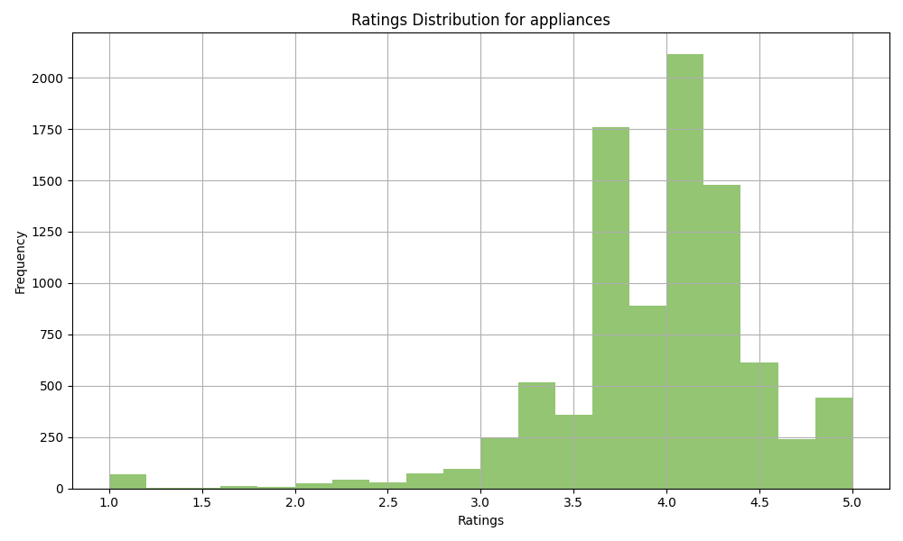
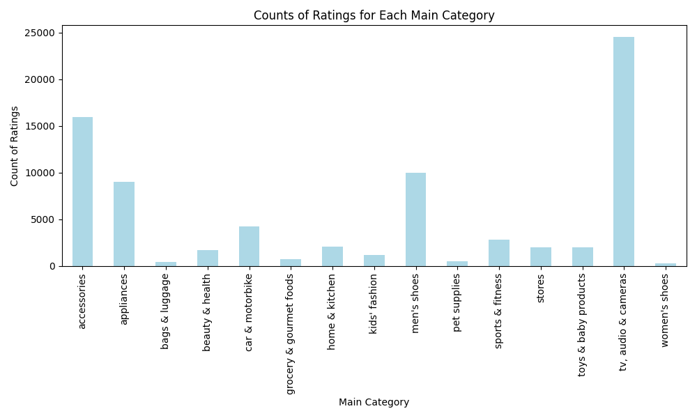
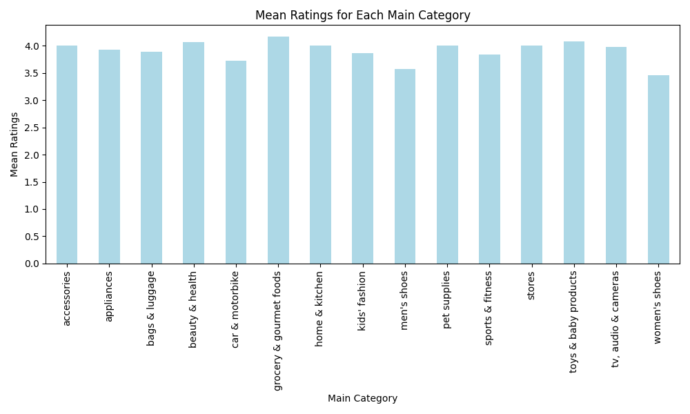

# Amazon Sales Dataset Report

## Counts of Main Categories
- accessories: 15961
- appliances: 9019
- bags & luggage: 473
- beauty & health: 1693
- car & motorbike: 4281
- grocery & gourmet foods: 746
- home & kitchen: 2089
- kids' fashion: 1207
- men's shoes: 10011
- pet supplies: 541
- sports & fitness: 2819
- stores: 1985
- toys & baby products: 2014
- tv, audio & cameras: 24567
- women's shoes: 332

## Counts of Sub Categories
- Air Conditioners: 321
- All Appliances: 8698
- All Car & Motorbike Products: 1104
- All Electronics: 9002
- All Exercise & Fitness: 987
- All Grocery & Gourmet Foods: 746
- All Home & Kitchen: 1132
- All Pet Supplies: 541
- All Sports, Fitness & Outdoors: 1095
- Amazon Fashion: 1985
- Baby Bath, Skin & Grooming: 1066
- Baby Fashion: 1207
- Baby Products: 948
- Backpacks: 473
- Badminton: 354
- Bags & Luggage: 15961
- Ballerinas: 332
- Beauty & Grooming: 1693
- Bedroom Linen: 957
- Camera Accessories: 7603
- Cameras: 7962
- Camping & Hiking: 259
- Car & Bike Care: 595
- Car Accessories: 1053
- Car Electronics: 690
- Car Parts: 839
- Cardio Equipment: 124
- Casual Shoes: 10011

## Visualizations
### Ratings Distribution Histogram

### Bar Charts

## Descriptive Statistics for Ratings and Number of Ratings
| Main Category | Mean Ratings | Median Ratings | Std Dev | Mean No of Ratings |
| ------------- | ------------ | -------------- | ------- | ------------------ |
| accessories | 4.00 | 4.00 | 0.59 | 376.84 |
| appliances | 3.93 | 4.00 | 0.55 | 846.31 |
| bags & luggage | 3.89 | 4.10 | 0.86 | 929.59 |
| beauty & health | 4.07 | 4.10 | 0.42 | 1205.89 |
| car & motorbike | 3.72 | 3.80 | 0.80 | 289.55 |
| grocery & gourmet foods | 4.17 | 4.20 | 0.32 | 900.34 |
| home & kitchen | 4.00 | 4.00 | 0.56 | 1853.57 |
| kids' fashion | 3.86 | 3.90 | 0.80 | 141.09 |
| men's shoes | 3.57 | 3.70 | 0.88 | 200.34 |
| pet supplies | 4.00 | 4.10 | 0.60 | 817.12 |
| sports & fitness | 3.83 | 3.90 | 0.68 | 558.64 |
| stores | 4.00 | 4.00 | 0.37 | 3088.89 |
| toys & baby products | 4.07 | 4.20 | 0.56 | 3668.14 |
| tv, audio & cameras | 3.97 | 4.00 | 0.62 | 4906.69 |
| women's shoes | 3.46 | 3.60 | 1.09 | 32.32 |
